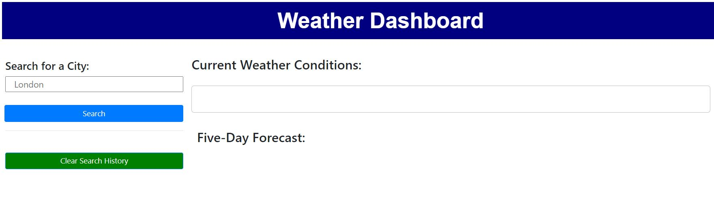
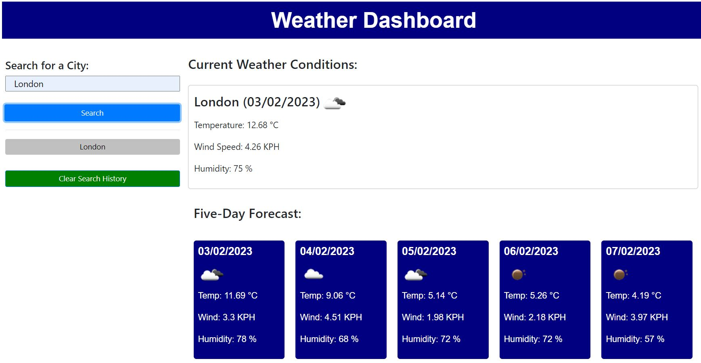
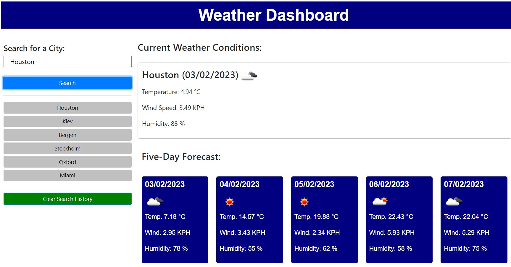

# Travel Companion Weather Dashboard

## Description

The objective of this project was to create a weather dashboard for a traveller, which shows the weather outlook over 5 days for multiple cities.

Weather data for numerous cities is retrieved dynamically using an API for another application, and then applied within the context of the dashboard.

The application was built to run in the browser, and features dynamically updated HTML and CSS. 

## Installation

The application, linked below, was deployed using GitHub Pages. 

Simply upload the index.html and license.txt files, along with the contents of the assets folder which include the JavaScript, CSS and image files, to the desired webserver.

## Usage

[Link to the deployed Travel Companion Weather application on GitHub Pages](https://ccmong.github.io/travel-companion-weather-app/)

[Link to the GitHub code repository](https://github.com/CcMong/travel-companion-weather-app)

The weather dashboard has a search field with form inputs. When the user searches for a city, the dashboard shows the current weather conditions and future conditions over the next five days inclusive.

The current and future conditions show the city name, the date, an icon that represents the conditions, temperature, wind speed and humidity.

A search history is also displayed on the left side of the page with previously searched cites. 

The most recent search will be shown on top of the stack, which is limited to 6 cities. Each of the cities in the history can be clicked directly to display current and future information relating to that city again.

The search history will persist despite the webpage being refreshed. At any time, however, the user can decide to clear the search history by clicking the "Clear Search History" button. 

## Credits

[OpenWeather API Website](https://openweathermap.org/api)

## License

MIT License.

Please refer to the LICENSE in the repo.

## Badges

